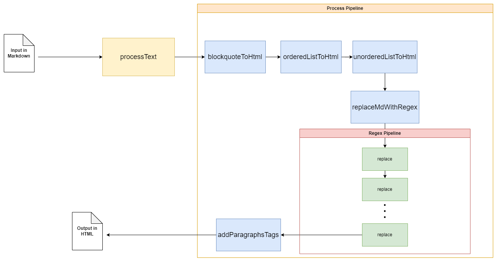

# JavaScript Funcional - Markdown To HTML

Este es el repositorio de la tarea 1 del grupo 2 del curso IIC3585.

## 📑 Features
Este programa soporta las siguientes syntaxis de Markdown:
- ✔ Headings
- ✔ Párrafos
- ✔ Line Breaks
- ✔ Bold e Italics
- ✔ Blockquotes
- ✔ Blockquotes con indentación
- ✔ Listas ordenadas y no ordenadas (sin elementos entre ellas)
- ✔ Código y bloques de código (con backticks)
- ✔ Links
- ✔ Imágenes

No soporta:
- ❌ Horizontal rules
- ❌ Escaping characters
- ❌ Contenido dinámico en listas

## 💡 Cómo funciona

Utilizando el paradigma de programación funcional en JavaScript, este programa procesa un texto de entrada en formato Markdown y lo convierte a HTML. Esto se logra mediante un pipeline de funciones que analizan y transforman secuencialmente los diversos formatos específicos de Markdown mencionados previamente, resultando en su equivalente en HTML.  

Para esto, se puede colocar el texto en formato Markdown en la pestaña del front, en localhost, se va a mostrar el texto en html en la misma página. Otra forma de hacerlo es insertar el texto en un archivo .md, cambiar el código del archivo `./public/src/main.js`, correr en la terminal dicho archivo y así se generará un archivo .html en la carpeta `./outputs` llamado `page.html`.

El flujo del programa se puede ver en el siguiente diagrama:

## 🚀 Correr código

Antes de correr el programa debes ejecutar el comando `npm install` para instalar todas las dependencias del programa.  

Existen dos opciones para correr el código, a través de la consola o en la página web. Para correr el código en la **consola** debes hacer lo siguiente:
- Elegir el archivo a transformar en `./public/src/main.js`.
- Correr el comando `npm run parse`
- Ver el resultado en `./outputs/page.html`

Por otro lado, para verlo en la web hay que hacer lo siguiente:
- Correr el comando `npm run start`
- Dirigirse a [localhost:3000](http://localhost:3000)
- Colocar el texto a transformar como se indica en la web.
- Pulsar el botón ***Generar HTML*** y ver el resultado renderizado en la derecha
